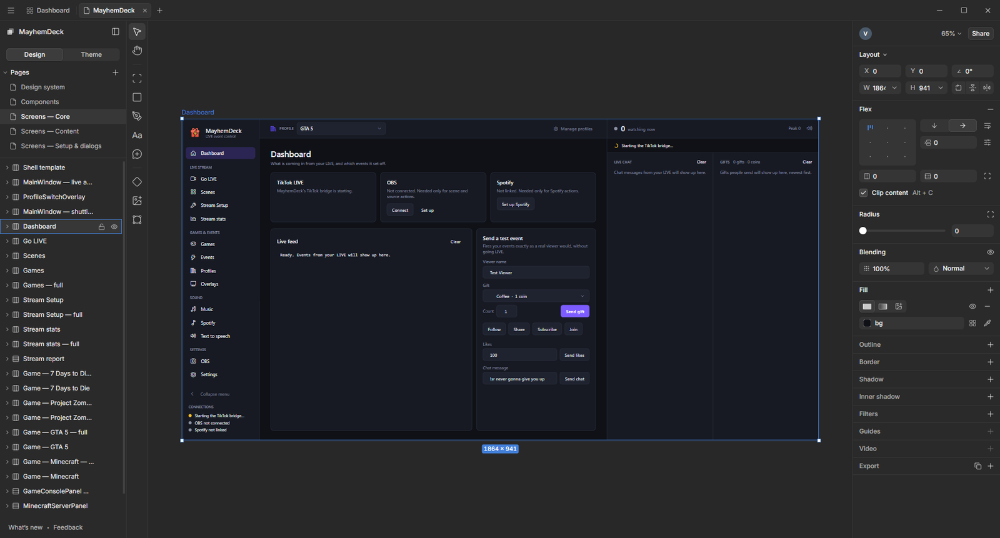
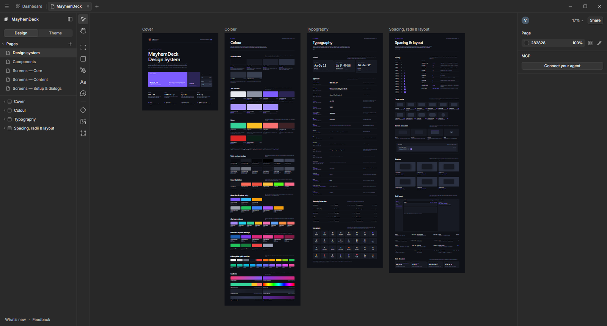
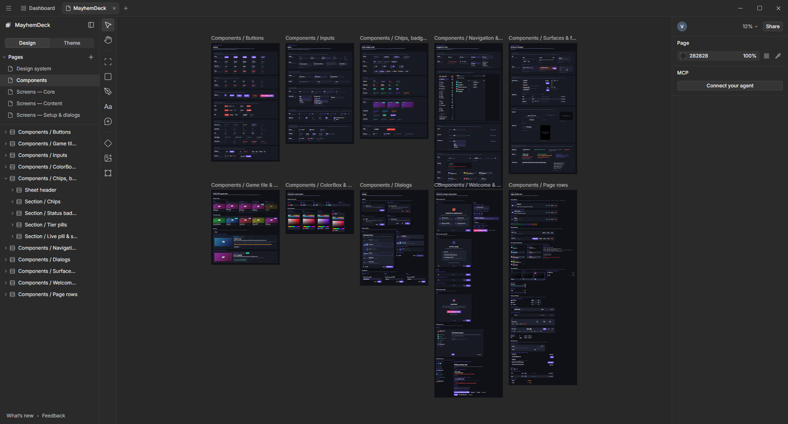
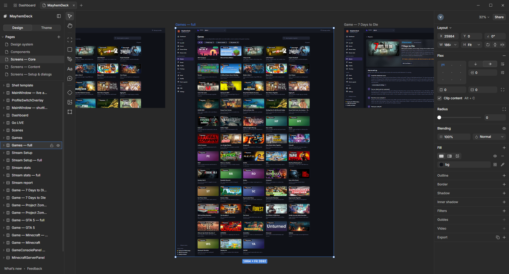
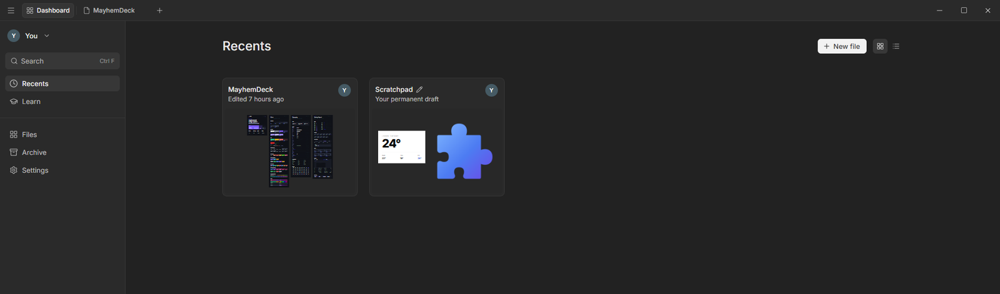
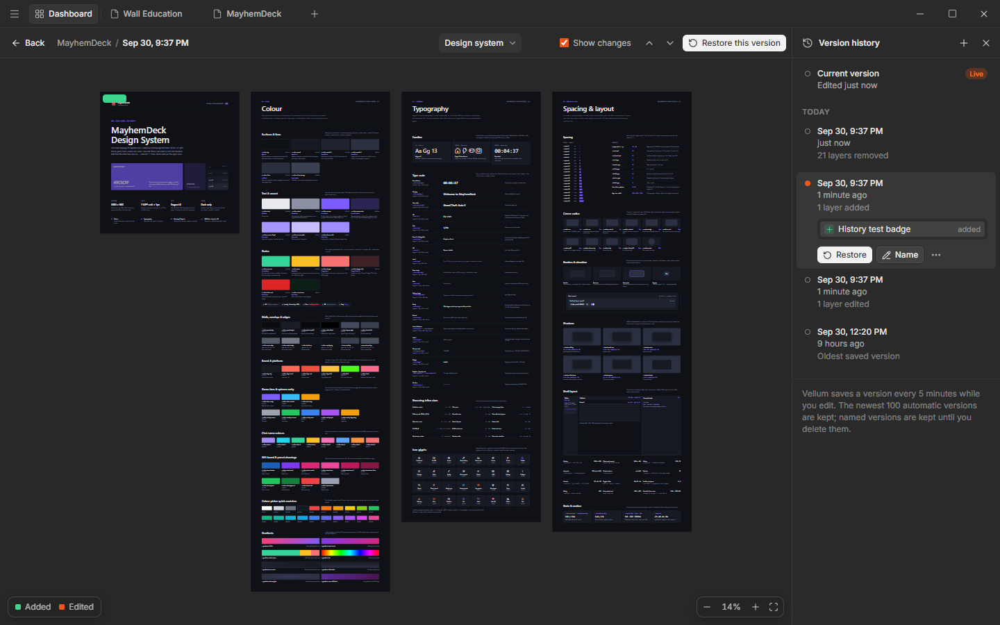

<p align="center"></p>

<h1 align="center">Vellum</h1>

<p align="center"><a href="https://github.com/Obiwayne/Vellum/actions/workflows/ci.yml"></a></p>

<p align="center">
  A free, local-first design tool where <b>designs are real HTML/CSS</b> —<br />
  with a built-in <b>MCP server so Claude can design in it</b> while you watch.
</p>

<p align="center">
  
</p>

Vellum gives you an infinite canvas, artboards, flex layout, design tokens and a compact dark editor.
There are no online accounts, teams or subscriptions: your files stay on your machine. Several people can share
one PC with local profiles, each optionally protected by a password that encrypts their files.

Everything on the canvas is an HTML element with CSS styles, so what you design is exactly what a browser
renders, and it exports cleanly to HTML, JSX or images. That also makes it a natural fit for AI agents:
Claude writes HTML into the canvas through Vellum's MCP server, screenshots its own work and refines it.

## Screenshots

The design shown here is a complete rebuild of a real desktop app, [MayhemDeck](https://github.com/Obiwayne/MayhemDeck):
its design system, component sheets and every screen and dialog (85 artboards), made in Vellum by Claude through the MCP server.

<table>
  <tr>
    <td width="50%"><p align="center"><sub>Design system page</sub></p></td>
    <td width="50%"><p align="center"><sub>Component sheets with every state</sub></p></td>
  </tr>
  <tr>
    <td width="50%"><p align="center"><sub>Full-length screen with flex layout</sub></p></td>
    <td width="50%"><p align="center"><sub>Dashboard with live thumbnails</sub></p></td>
  </tr>
  <tr>
    <td colspan="2"><p align="center"><sub>Version history: step through versions, see what changed, restore</sub></p></td>
  </tr>
</table>

## Features

- **Canvas** — infinite pan and zoom (2%–25600%), artboards, frames, rectangles, text, pen paths, images and SVG;
  selection handles, marquee select, snapping guides, drag-to-reorder inside flex layouts, inline text editing.
  Drag **padding and gap handles** right on flex/grid frames, and **gradient handles** (angle, stops, radial
  centre and radius) on gradient fills. `Ctrl`+right-click lists every layer under the pointer.
- **Images** — paste screenshots and copied images with `Ctrl+V` (including image files copied in File Explorer),
  or drag image files straight onto the canvas; they land where you drop them. `Ctrl`+drag a handle to **crop**.
- **Inspector** — layout (X/Y, rotation, Fixed/Fit/Fill sizing, device size presets), **constraints**
  (left/right/centre/scale when the parent resizes, as real CSS), flex (direction, alignment grid, gap,
  padding, wrap), CSS grid (columns, rows, gaps, cell alignment, item spans), radius, opacity and blend modes,
  solid/gradient/image fills, outline, border, shadows, inner shadows, filters with sliders and one-click
  presets, background blur (frosted glass); fills, shadows and filters reorder by dragging.
  - **Selection colors** — every colour in the selection with a use count; change one and it changes
    everywhere. Any colour field can **add the colour as a token**.
  - **Other styles** — any CSS the other panels don't cover (often written by an AI: `transform`,
    `aspect-ratio`, `z-index`…) is listed and editable, and you can add your own properties.
  - **Typography** — font picker, full text settings, **OpenType features** (tabular/oldstyle figures, slashed
    zero, fractions, ligatures, small caps, custom `font-feature-settings`) and **variable font axes**
    (read from local font files). New text starts with the last text style you used.
- **Export & code** — PNG, JPG and WebP (2x by default), SVG, HTML and **PDF**, plus one multi-page PDF of all
  artboards. Copy as HTML, CSS, JSX, **React** (`Alt+R`) or **Tailwind** (`Alt+T`).
- **Icons** — search and insert any of ~1,850 Lucide icons as editable SVG, with size, stroke and colour
  (`Shift+I`).
- **Layers & pages** — layers tree with drag-and-drop, show/hide, lock and rename (`Alt+L` collapses all);
  multiple pages per file, reordered by dragging. The left sidebar and the Pages list are resizable.
- **Theme tokens** — CSS custom-property tokens (colours, type, spacing, radii…) with a starter theme;
  use them anywhere as `var(--token)`. **Theme modes** (e.g. Light / Dark) give each token a value per mode;
  put any frame in a mode and everything inside follows. Exports include `[data-mode="…"]` CSS.
- **Comments** — press `C` and click a layer to pin a comment ("make this say Get started"). Ask your AI to
  address your comments: it makes the change, replies in the thread and resolves it.
- **Version history** — Vellum saves a version of each file every 5 minutes while you edit (the newest 100
  are kept) and you can save named versions with `Ctrl+Alt+S`. Open **History** from a file's `…` menu on the
  dashboard (or `Ctrl+Alt+H` in a file) to step through versions, see what changed (layers added, edited and
  removed are outlined on the canvas and listed), restore one or copy it to a new file. A restore keeps the
  state it replaced as a version and can be undone.
- **Dashboard** — recents, files, nested folders (drag files onto folders), archive, search, grid/list views
  and live thumbnails. Select several files (`Ctrl`/`Shift`+click, `Ctrl+A`) to move, archive or delete them
  together.
- **Editing** — undo/redo, copy/paste (including HTML from other apps), right-click menus and keyboard
  shortcuts throughout.
- **Profiles & privacy** — local profiles with an optional password that encrypts your files (see below).
- **Components & variants** — make a component (`Ctrl+Alt+K`), place instances that follow the main, override
  text and styles per instance, detach. **Add variant** turns a component into a set (State / Size / …): rename the
  property and its values, switch an instance's variant (overrides carry over, with a toast for any that can't),
  and add boolean, text and swap properties that drive layers inside the component. The Assets panel lists
  components of every page with live thumbnails and expandable sets; drag one onto the canvas to place it. See
  `docs/COMPONENTS.md`.
- **MCP server** — 47 tools (`write_html`, `update_styles`, `get_screenshot`, `get_jsx` (instances export as
  component usage plus definitions), components, variants and properties, text styles, tokens and theme
  modes, comments, pages, export to PNG/JPG/WebP/SVG/PDF/HTML/JSX…). Works with Claude Code, Codex and other MCP clients. Layers an agent is
  working on are outlined live on the canvas with a tag.

### Profiles & privacy

Vellum keeps a separate **profile** for each person using the PC — a name, an optional picture and an optional
password. Profiles are purely local: no server, no online account. On start you pick your profile (with a single
profile that has no password, Vellum opens it straight away). The account menu in the dashboard has
**Edit profile**, **Switch profile**, **Lock** and **Delete profile**; Settings has **Auto-lock after** for
protected profiles.

- **Without a password** your files are stored as plain JSON, readable by anyone who uses this Windows account.
- **With a password** every file of the profile (designs, file list, preferences) is encrypted on disk with
  AES-256-GCM. The encryption key is random and is itself locked by your password (scrypt); it only exists in
  memory while the profile is open, so nobody else on the PC can read your files, in Vellum or from File Explorer.
  While a profile is locked, the MCP tools refuse to work.
- **Recovery key**: when you set a password you get a one-time recovery key (`XXXX-XXXX-…`). Copy it or save it as
  a `.txt` somewhere safe: it is the only way back in if you forget the password (*Forgot password? → Use recovery
  key*). **If you forget the password and lose the recovery key, your files can’t be recovered.**
- You can add, change or remove the password at any time (removing it decrypts the files back to plain JSON) and
  create a new recovery key from **Edit profile**.
- Upgrading from a version without profiles: the first profile you create takes over your existing files (they are
  copied into the profile, encrypted if you set a password, checked, and only then removed from the old folder).

## Requirements

- Windows 10 or 11
- [Node.js](https://nodejs.org) 22+ and npm

## Getting started

```bash
git clone https://github.com/Obiwayne/Vellum.git
cd Vellum
npm install
cd mcp && npm install && npm run build && cd ..
npm run dev
```

Or just double-click **`Vellum.cmd`**: the first time it installs and builds everything, then it opens the app
and closes its console. It rebuilds by itself whenever the code is newer than the last build (after a `git pull`
or an edit), so restarting Vellum is enough to get changes.

For a launcher with no console at all, run this once — it creates a **Vellum** shortcut with the app icon in the
project folder and on your Desktop (it runs `Vellum.cmd` hidden, so it rebuilds too):

```powershell
powershell -ExecutionPolicy Bypass -File scripts\make-shortcuts.ps1
```

| Command | What it does |
|---|---|
| `npm run dev` | Run with hot reload |
| `npm run build` | Typecheck and build |
| `npm start` | Run the built app |
| `npm run typecheck` | TypeScript checks only |

## Updates

Vellum checks GitHub for new versions when it starts and every four hours after that. When one is out, an
**Update** badge appears in the title bar and a card lists what changed. **Update and restart** downloads it,
installs any new packages, rebuilds and reopens Vellum. Your files are not touched. **Later** hides the card
for a day. You can also check at any time with **Help → Check for Updates…**.

This works for copies installed with `git clone`. If you edited Vellum's own files, commit or undo those edits
first. Otherwise the update is refused so nothing is overwritten. A copy downloaded as a ZIP can't update
itself: download the new version from GitHub instead. Set `VELLUM_NO_UPDATE_CHECK=1` to turn the automatic
check off.

Your data lives in `%APPDATA%\Vellum`: `profiles.json` lists the profiles, and each profile's files are in
`profiles\<id>\` (plain JSON, or encrypted when the profile has a password).

## Let Claude design in Vellum

1. Start Vellum.
2. Register the MCP server with Claude Code. The exact command for your copy is shown in the app under
   **Connect your agent**; it looks like this:
   ```bash
   claude mcp add vellum -- node C:/path/to/Vellum/mcp/dist/index.js
   ```
3. Start a new Claude Code session and ask, for example:
   *"Create a pricing card for a coffee subscription in Vellum."*

The MCP server is started by Claude Code in the background — you only need the Vellum app open.
It talks to the app over `ws://127.0.0.1:29170` (change it with the `VELLUM_PORT` environment variable).
The tools work on the profile that is open in the app; while Vellum shows the profile picker or is locked they
return "Vellum is locked — open your profile in the app first".
See [`docs/MCP.md`](docs/MCP.md) for the full tool list and troubleshooting.

## Keyboard shortcuts (highlights)

| Tool / action | Shortcut |
|---|---|
| Move · Pan | `V` · `H` (or hold `Space`) |
| Frame · Rectangle · Pen · Text | `F` · `R` · `P` · `T` |
| Comment · Show/hide comments | `C` · `Shift+C` |
| Icons | `Shift+I` |
| Add / wrap in flex | `Shift+A` |
| Group · Ungroup · Frame selection | `Ctrl+G` · `Ctrl+Shift+G` or `Shift+Backspace` · `Ctrl+Alt+G` or `Shift+F` |
| Create component / Detach instance | `Ctrl+Alt+K` / `Ctrl+Alt+B` |
| Opacity 10%–90% · 100% | `1`–`9` · `0` |
| Bold · Italic · Underline | `Ctrl+B` · `Ctrl+I` · `Ctrl+U` |
| Font size · weight · letter spacing · line height | `Ctrl+Shift+.`/`,` · `Ctrl+Alt+.`/`,` · `Alt+.`/`,` · `Alt+Shift+.`/`,` |
| Copy as React · Tailwind | `Alt+R` · `Alt+T` |
| Crop an image | hold `Ctrl` while resizing |
| Layers under the pointer | `Ctrl`+right-click |
| Zoom to 100% · fit · selection | `Shift+0` · `Shift+1` · `Shift+2` |
| Copy · Paste · Duplicate · Delete | `Ctrl+C` · `Ctrl+V` · `Ctrl+D` · `Delete` |
| Undo · Redo | `Ctrl+Z` · `Ctrl+Shift+Z` |
| Save version · Version history | `Ctrl+Alt+S` · `Ctrl+Alt+H` |
| Bring to front · Send to back | `]` · `[` |

The full list is on the **Learn** page in the app's dashboard.

## Project structure

```
src/main/        Electron main process: window, file storage, clipboard, MCP bridge, offscreen rendering
src/preload/     Safe API exposed to the renderer
src/renderer/    React UI: shell, dashboard, editor (canvas, toolbar, inspector, left panel), model/store
mcp/             MCP server (stdio) + tests (mcp/test/regress.mjs)
resources/       App icon (SVG, PNG, ICO)
scripts/         Helper scripts (desktop shortcuts)
docs/            Architecture, component docs and screenshots
```

Built with Electron, electron-vite, React, TypeScript, zustand and immer.

## Docs

- [Architecture](docs/ARCHITECTURE.md) · [Foundation / store API](docs/FOUNDATION.md)
- [Canvas](docs/CANVAS.md) · [Inspector](docs/INSPECTOR.md) · [Left panel & dashboard](docs/LEFT_DASHBOARD.md)
- [MCP server](docs/MCP.md) · [Bug log](docs/BUGS.md)
